# Seminario "Verdades Empíricas"
## Acuerdos inte...   ...   ...    ...umbre

Contactos a **bayesdelsur@gmail.com**

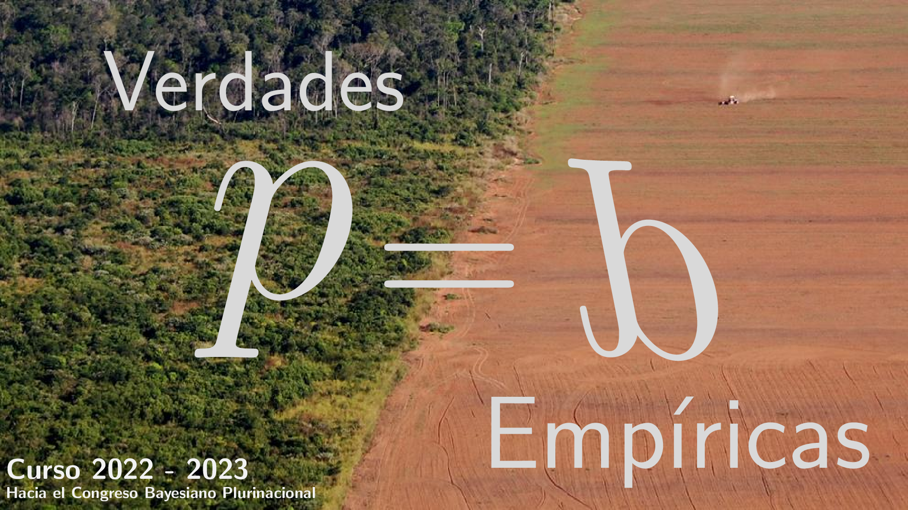

-------------------------------------------------------

## Objetivos

A diferencia de las ciencias formales, que validan sus proposiciones dentro de sistemas axiomáticos cerrados, las ciencias empíricas (desde la física hasta las ciencias sociales) deben validar sus proposiciones en sistemas abiertos que por definición contienen siempre algún grado de incertidumbre. ¿Es posible alcanzar "verdades" si es inevitable decir "no sé"?. Sí. La aplicación estricta de las reglas de la probabilidad (enfoque Bayesiano) garantiza los acuerdos intersubjetivos en contextos de incertidumbre, fundamento de las verdades empíricas. Bajo incertidumbre, la lógica es paraconsistente en tanto se hace necesario creer al mismo tiempo en A y no A hasta que la sorpresa, única fuente de información, decida. Debido a que este proceso de selección es, como el evolutivo, de naturaleza multiplicativa (un solo cero en la secuencia de reproducción y supervivencia genera una extinción), existe una ventaja a favor de las variantes que reducen las fluctuaciones. Si bien la aplicación estricta de la teoría de la probabilidad ha mostrado ser la lógica ideal en contextos de incertidumbre, su adopción se vio históricamente limitada debido al alto costo computacional asociado: a diferencia del enfoque frecuentista de la probabilidad que selecciona una única hipótesis, el enfoque Bayesiano actualiza las creencias de todas y cada una de las hipótesis de acuerdo a la evidencia empírica y formal (datos y modelos). Si bien en las últimas décadas las limitaciones computacionales han sido superadas en gran medida gracias al desarrollo de métodos eficientes de aproximación, la inercia histórica es ahora su limitación principal. **Este curso tiene por objetivo promover la adopción del enfoque Bayesiano como método general para la resolución de cualquier problema empírico: en la ciencia, la política y la ecología.**

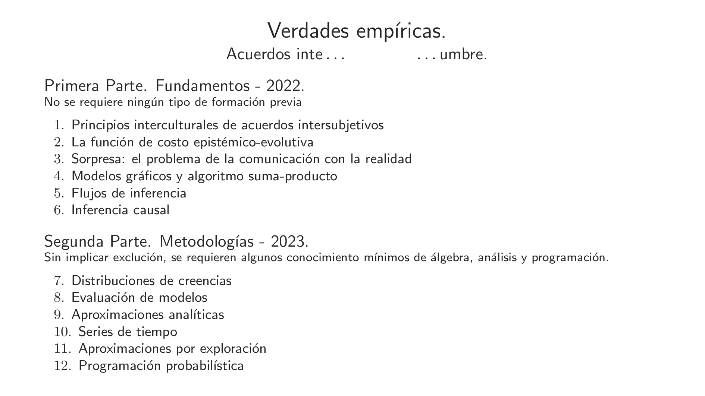

### Primera Parte: Fundamentos

#### Capitulo 1

#### Capitulo 2
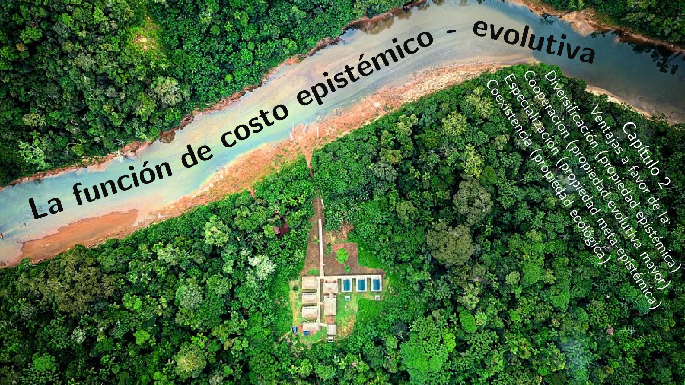

#### Capitulo 3
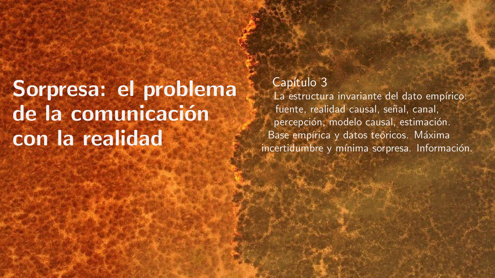
#### Capitulo 4

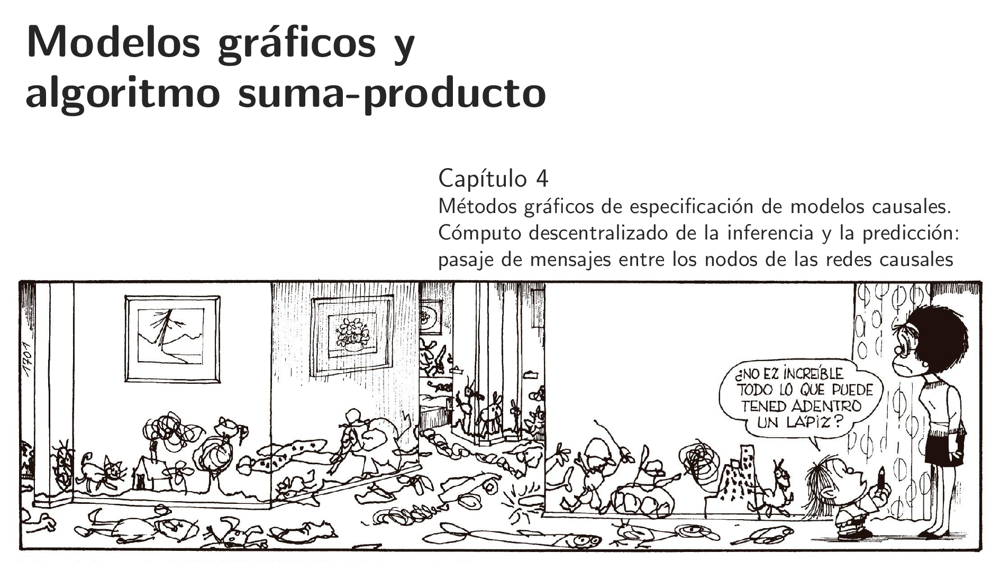
#### Capitulo 5

#### Capitulo 6
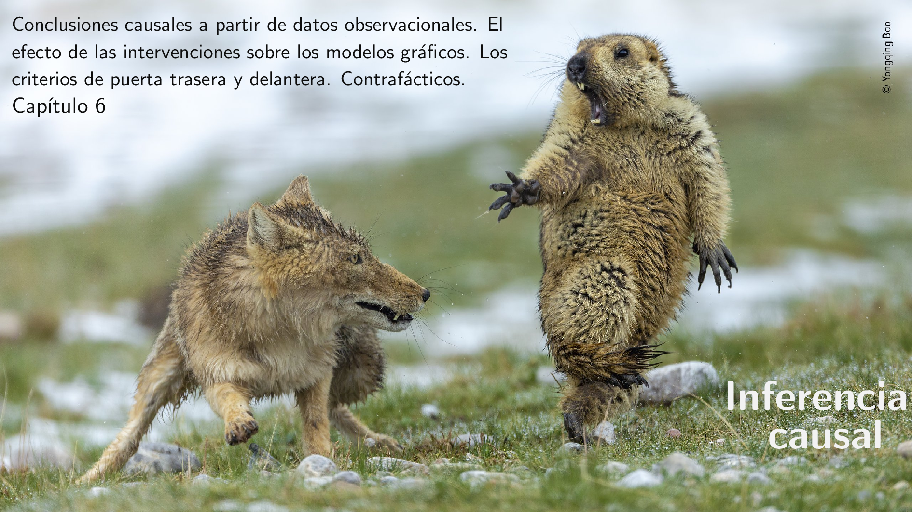

### Segunda Parte: Metodologı́as

#### Capitulo 7
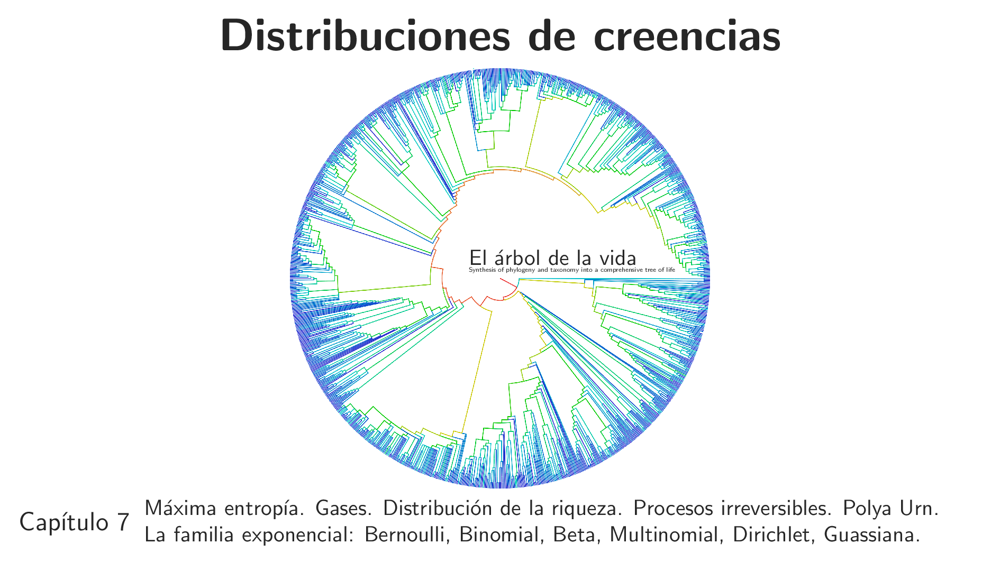
#### Capitulo 8
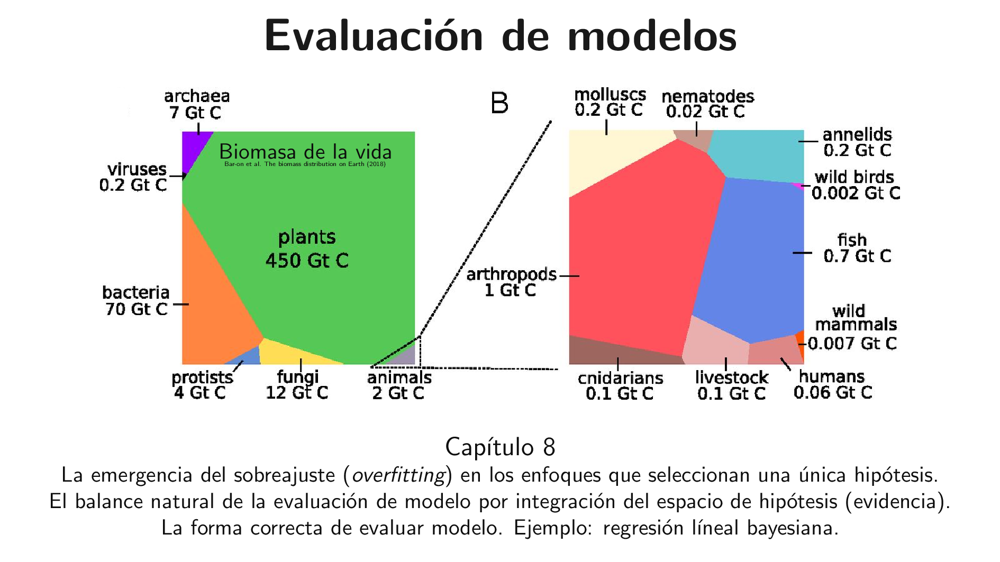
#### Capitulo 9
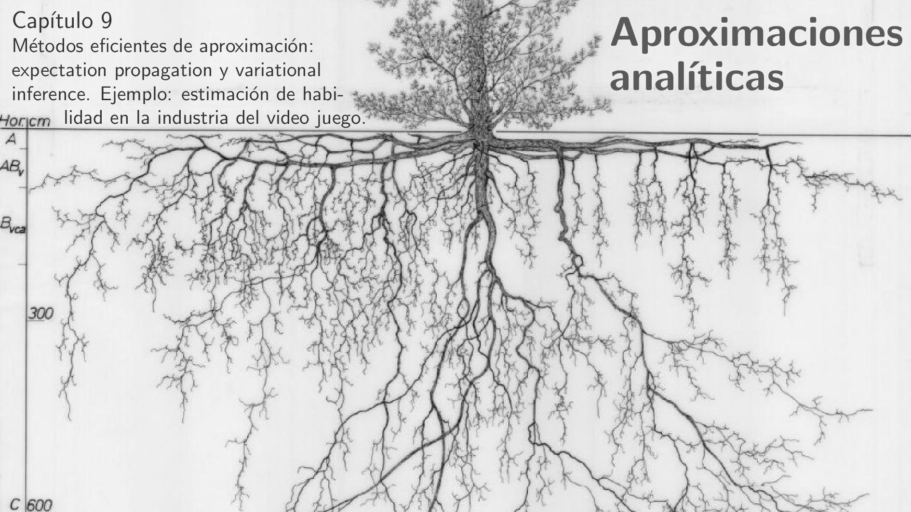
#### Capitulo 10
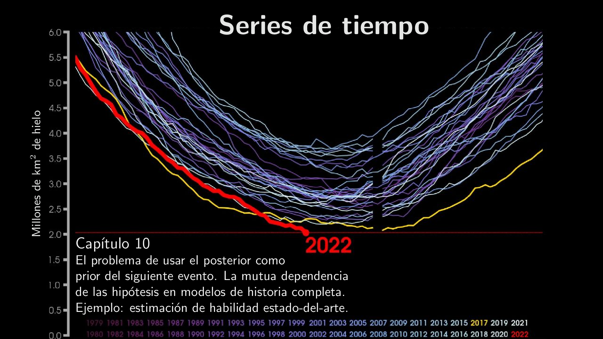
#### Capitulo 11

#### Capitulo 12
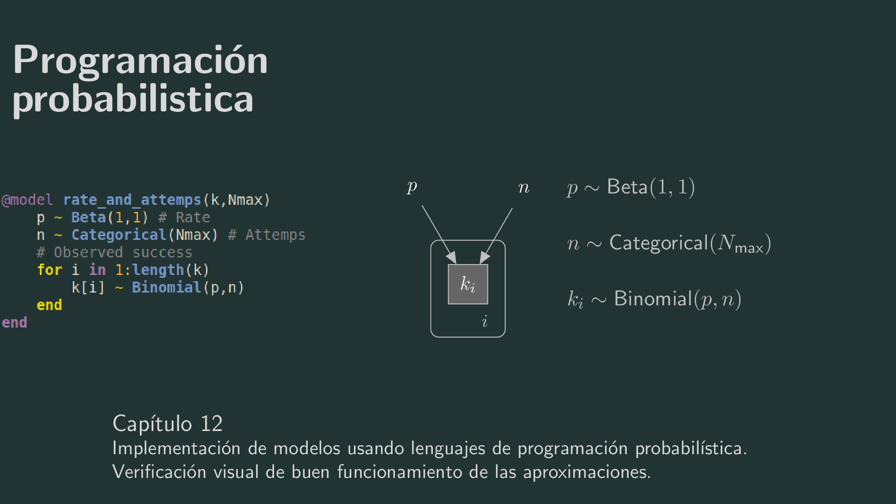

### Mision

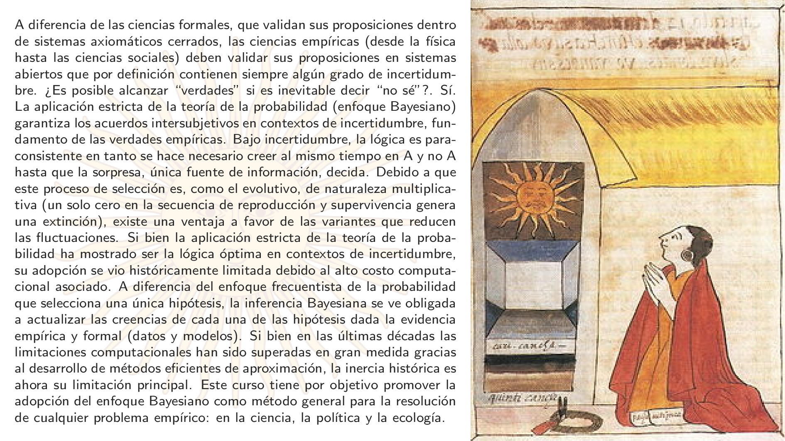
