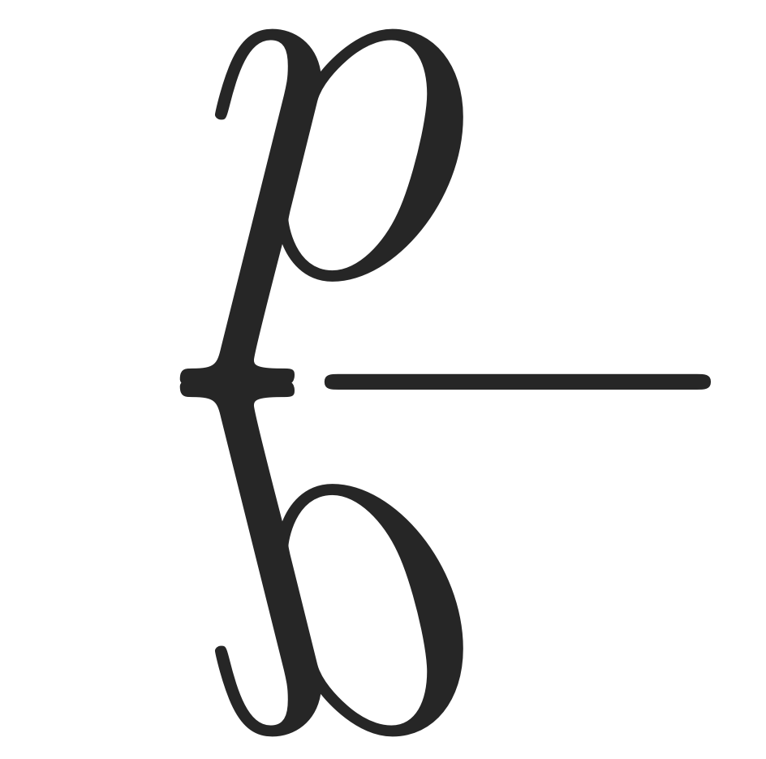
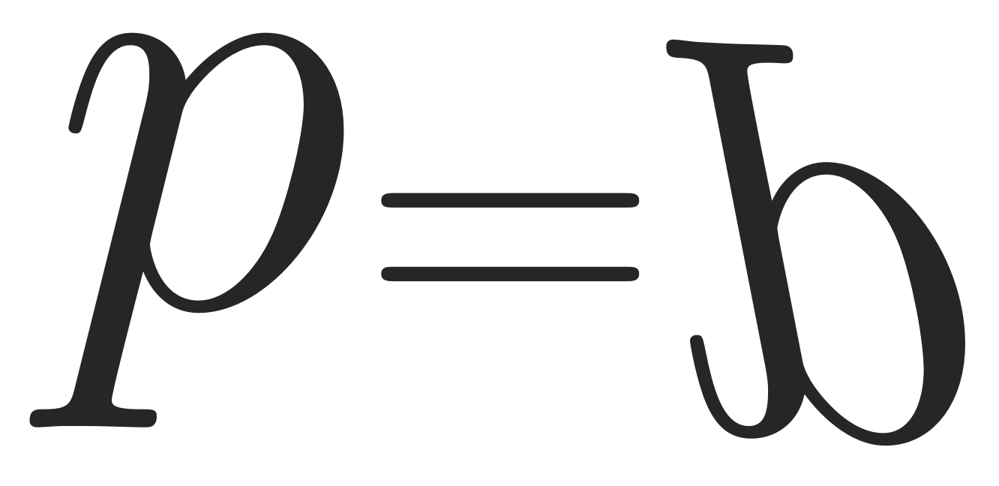

# Bayes de la Provincias Unidas del Sur

El grupo participa de:

1. [Comunidad Bayesiana Plurinacional](## Comunidad Bayesiana Plurinacional)
2. [Empresa Pacha Suyus](## Empresa Pacha Suyus)
3. [Seminario Verdades Empíricas](## Seminario Verdades Empíricas)

## Comunidad Bayesiana Plurinacional

## Empresa Pacha Suyus

## Seminario Verdades Empíricas

